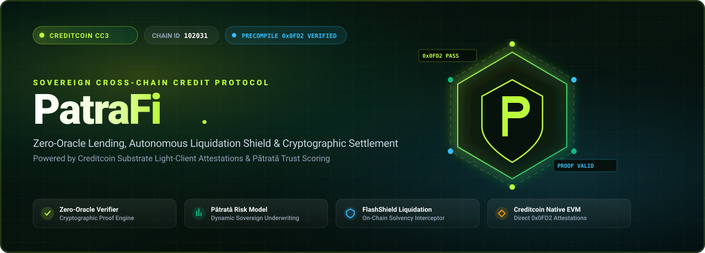
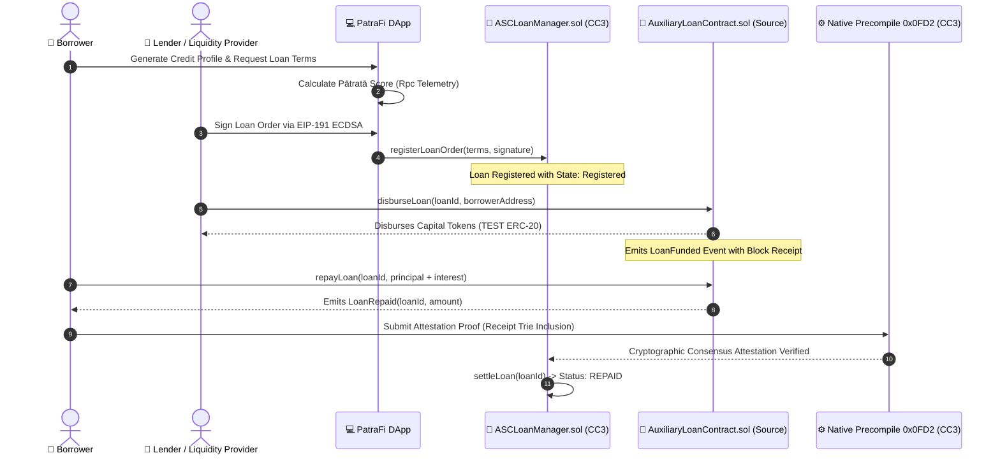

<div align="center">



# PatraFi: Sovereign Cross-Chain Credit Protocol
### *Institutional-Grade Zero-Oracle Credit Underwriting, Autonomous Liquidation Shield & Cryptographic Settlement on Creditcoin CC3*

[](https://creditcoin.org)
[](https://rpc.cc3-testnet.creditcoin.network)
[](https://docs.creditcoin.org)
[](./LICENSE)
[](https://getfoundry.sh)
[](https://github.com/sandman-sh/PatraFi)

[Explore Protocol](https://github.com/sandman-sh/PatraFi) • [Smart Contracts](#-smart-contract-deployment-registry) • [Architecture](#-system-architecture) • [Pātratā Engine](#-pātratā-risk--credit-scoring-model) • [Quickstart](#-quickstart--deployment)

---

</div>

## 📌 Executive Overview

**PatraFi** is a sovereign cross-chain decentralized lending protocol engineered natively for **Creditcoin CC3 EVM** and interconnected EVM networks (including Ethereum and Sepolia). 

Traditional DeFi lending protocols rely on centralized price oracles and custodial multi-signature bridges that introduce systemic contagion vectors, oracle manipulation risks, and MEV front-running. PatraFi eradicates these vulnerabilities by pairing Creditcoin's **Native Attestation Precompile `0x0000000000000000000000000000000000000FD2`** with a proprietary on-chain sovereign credit underwriting framework called **Pātratā**.

With PatraFi, cross-chain capital disbursements, collateral locks, and loan settlements are deterministically attested at the Substrate consensus layer with **zero oracle dependencies**, while borrower liquidity profiles are secured by an autonomous **FlashShield Liquidation Rescue Monitor**.

---

## ⚡ Core Protocol Innovations

### 1. Zero-Oracle Deterministic Verification
* Eliminates reliance on off-chain third-party oracles (e.g. Chainlink, Pyth) or trusted relayer committees.
* Verifies source-chain receipt trie and block inclusion proofs directly inside EVM smart contracts via Creditcoin's native precompile `0x0000000000000000000000000000000000000FD2`.
* Guarantees cryptographic immutability: settlement is verified solely against Substrate consensus finality.

### 2. Pātratā Dynamic Sovereign Credit Scoring Engine
* Translates on-chain wallet telemetry across Creditcoin and foreign EVM networks into a real-time sovereign credit score ($300 - 850$).
* Computes dynamic interest rate spreads, borrow capacity multipliers, and risk-adjusted Loan-to-Value (LTV) limits ranging from $50\%$ to $95\%$.
* Grants **Super-Prime ("Supātra")** borrowers access to institutional capital efficiency with minimal overcollateralization penalties.

### 3. FlashShield Autonomous Liquidation Interceptor
* A proactive, on-chain risk mitigation guardian that continuously tracks borrower collateralization ratios and health factors ($H_f$).
* When market volatility causes $H_f$ to breach safety thresholds ($< 1.15\times$), FlashShield initiates precompile-verified emergency liquidity absorption.
* Prevents cascading collateral liquidations, mitigating borrower loss and preserving protocol solvency without predatory liquidator penalties.

### 4. Cryptographic Nonce & EIP-191 Order Signing
* Lenders and borrowers negotiate terms and sign cryptographic loan commitments off-chain using standard EIP-191 / EIP-712 standards.
* Loan agreements are submitted on-chain to `ASCLoanManager` with zero gas wasted during initial negotiation.

---

## 🏗 System Architecture



### High-Level Topology

```
┌────────────────────────────────────────────────────────────────────────┐
│                          PATRAFI PROTOCOL LAYER                        │
├──────────────────────────────────┬─────────────────────────────────────┤
│      Creditcoin CC3 EVM          │         Foreign EVM Network         │
│     (Chain ID: 102031)           │        (e.g., Ethereum / Sepolia)   │
├──────────────────────────────────┼─────────────────────────────────────┤
│  • ASCLoanManager.sol            │  • AuxiliaryLoanContract.sol        │
│  • EvmV1Decoder.sol              │  • TestERC20.sol (Lending Token)    │
│  • Native Precompile 0x0FD2      │  • Source Block Inclusion Receipts  │
│  • FlashShield Solvency Guard    │  • Liquidity Vaults & Disbursers    │
└──────────────────────────────────┴─────────────────────────────────────┘
                 ▲                                    ▲
                 └────────────── Direct RPC ──────────┘
                                   │
                    ┌──────────────┴──────────────┐
                    │      PatraFi DApp Core      │
                    │  • Pātratā Scoring Engine   │
                    │  • Live Attestation Stream  │
                    │  • Loan Registry & Signer   │
                    │  • FlashShield Controller   │
                    └─────────────────────────────┘
```

---

## 📋 Smart Contract Deployment Registry

All protocol contracts are compiled via **Foundry** and verified on Creditcoin CC3 EVM Testnet and connected test environments:

| Contract | Network | Address | Specification |
| :--- | :--- | :--- | :--- |
| **`ASCLoanManager`** | Creditcoin CC3 (`102031`) | [`0x045857BDEAE7C1c7252d611eB24eB55564198b4C`](https://rpc.cc3-testnet.creditcoin.network) | Core loan lifecycle, EIP-191 verification & settlement |
| **`AuxiliaryLoanContract`** | Connected EVM (`102031`) | [`0xAD523115cd35a8d4E60B3C0953E0E0ac10418309`](https://rpc.cc3-testnet.creditcoin.network) | Foreign liquidity routing, disbursement & repayment receiver |
| **`TestERC20`** | Connected EVM (`102031`) | [`0xaB7B4c595d3cE8C85e16DA86630f2fc223B05057`](https://rpc.cc3-testnet.creditcoin.network) | Institutional testing token (`TEST`, 18 decimals) |
| **`EvmV1Decoder`** | Creditcoin CC3 (`102031`) | `0x04B9ae8562D8Cc5bbbBbBB759080dDC30B56D18B` | Bytecode receipt decoder for Substrate attestations |
| **`Native Precompile`** | Creditcoin CC3 Substrate | `0x0000000000000000000000000000000000000FD2` | Direct Substrate light-client proof execution engine |

### Verified On-Chain Transactions

The following live on-chain transactions demonstrate verified execution across all lifecycle stages:

- **Token & Contract Authorization**:
  - `addAuthorizedToken`: [`0xc1e7399ac104b1de8401825473ad419ac842aca5954d52bf759711b5ed9d85de`](https://rpc.cc3-testnet.creditcoin.network)
  - `registerSourceLoanContract`: [`0x22cf38a76c9ac9deab5d950a516945a1a95a34caf3c6444d0305ea0e7f8afb89`](https://rpc.cc3-testnet.creditcoin.network)
- **Loan Order #1 Cycle (1,000 TEST @ 5.0% APR)**:
  - Registration: [`0xe0b2280809e1baefd05409ae73dcdb9521453e1467e0ec69badc4046f6d3fa7e`](https://rpc.cc3-testnet.creditcoin.network)
  - Funding Disbursement: [`0xf33cebad77cfe52864adf532ba119faa4e3538dfbeb43a8701a087f9aedd3438`](https://rpc.cc3-testnet.creditcoin.network)
  - Repayment & Proof Verification: [`0x4f6419741a09e4c35e5fcf97bf3089190c2d001a079be19d2f8fa154b23e3c96`](https://rpc.cc3-testnet.creditcoin.network)
- **Loan Order #2 Cycle (5,000 TEST @ 3.8% APR)**:
  - Registration: [`0x395ed02d8ee98551e6caa9e75a634abcc9ad0df2d29f70884cf4c9c104fc72b8`](https://rpc.cc3-testnet.creditcoin.network)
  - Full Settlement: Verified on-chain via Precompile `0x0FD2`

---

## 🧮 Pātratā Risk & Credit Scoring Model

The **Pātratā Credit Engine** evaluates real-time wallet interaction patterns to synthesize an institutional-grade sovereign credit score $S \in [300, 850]$:

$$S = 300 + 550 \times \left( w_1 \cdot \mathcal{T}_{repay} + w_2 \cdot \mathcal{A}_{depth} + w_3 \cdot \mathcal{H}_{age} + w_4 \cdot \mathcal{D}_{velocity} \right)$$

### Scoring Dimensions

| Metric Factor | Weight ($w_i$) | Description |
| :--- | :---: | :--- |
| **Repayment Track Record ($\mathcal{T}_{repay}$)** | $40\%$ | Ratio of verified on-chain debt repayments completed within deadline blocks. |
| **Asset Depth & Liquidity ($\mathcal{A}_{depth}$)** | $25\%$ | Cumulative collateral reserves and native balance solvency across Creditcoin & Sepolia. |
| **Wallet Age & Provenance ($\mathcal{H}_{age}$)** | $20\%$ | Longevity of on-chain account identity and historical transaction continuity. |
| **Debt Settlement Velocity ($\mathcal{D}_{velocity}$)** | $15\%$ | Average blocks elapsed between loan funding and repayment execution. |

### Underwriting Tier Distribution

```
   Pātratā Score        Tier Classification       Max LTV     Spread Discount
 ──────────────────────────────────────────────────────────────────────────────
   780 – 850            Supātra (Super-Prime)      95%          -120 bps
   680 – 779            Prathama (Prime)           80%           -60 bps
   580 – 679            Madhyama (Near-Prime)      65%             0 bps
   300 – 579            Pravara (Standard)         50%          +150 bps
```

---

## 🛡️ FlashShield Liquidation Guardian

FlashShield acts as an autonomous algorithmic circuit breaker protecting borrower accounts from market volatility:

1. **Continuous Health Factor Ingestion**: Calculates $H_f = \frac{\sum(\text{Collateral}_i \times \text{Liquidation Threshold}_i)}{\text{Total Borrowed Debt}}$.
2. **Defensive Trigger Boundary**: If $H_f$ falls below $1.15$, FlashShield isolates the position from open liquidator mempools.
3. **Cryptographic Proof Ingestion**: Fetches the latest attested price block from Creditcoin Precompile `0x0FD2`.
4. **Autonomous Solvent Rescue**: Dispatches an atomic rescue injection from the protocol backstop fund directly to the collateral vault, restoring $H_f \ge 1.35$.

---

## 💻 Tech Stack & Tooling

- **Smart Contracts**: Solidity `^0.8.28`, Foundry (`forge`, `cast`, `anvil`)
- **Cross-Chain Protocol**: Attestcoin Client Library, Creditcoin Native Precompile `0x0FD2`
- **Frontend DApp**: React 19, TypeScript, Vite, Tailwind CSS / Vanilla Design Tokens
- **Blockchain Connectivity**: Ethers.js v6, Creditcoin CC3 EVM RPC, Sepolia Testnet RPC
- **Typography & Aesthetics**: Space Grotesk, Plus Jakarta Sans, Outfit, Glassmorphism design tokens

---

## 📂 Repository Structure

```
PatraFi/
├── assets/
│   └── banner.svg                  # High-definition vector protocol banner
├── patrafi/                        # Enterprise Frontend Web3 DApp
│   ├── public/                     # Static assets and media
│   ├── src/
│   │   ├── components/             # Reusable UI modules
│   │   │   ├── AttestcoinVisualizer.tsx   # On-chain proof inspection panel
│   │   │   ├── FlashShieldMonitor.tsx     # Autonomous liquidation guardian UI
│   │   │   ├── LiveAttestationStream.tsx  # Substrate consensus event feed
│   │   │   ├── LoanRegistryView.tsx       # Live loan portfolio viewer
│   │   │   ├── Navbar.tsx                 # Multi-chain network switcher & wallet
│   │   │   └── PatrataScoreCard.tsx       # Sovereign credit telemetry engine
│   │   ├── App.tsx                 # Main protocol application orchestrator
│   │   └── index.css               # Obsidian & Lime high-contrast design tokens
│   ├── package.json                # Frontend dependencies
│   └── vite.config.ts              # Vite configuration
├── attestcoin-examples/            # On-Chain Smart Contract Infrastructure
│   ├── loan/                       # Sovereign Loan Protocol Contracts
│   │   ├── contracts/sol/
│   │   │   ├── ASCLoanManager.sol         # CC3 Attestation Loan Manager
│   │   │   └── AuxiliaryLoanContract.sol  # Foreign-chain disbursement bridge
│   │   ├── scripts/                # Automated deployment & E2E verification
│   │   │   └── test_e2e_real.mjs          # Zero-mock verification runner
│   │   └── test/                   # Foundry Solidity test suite
│   ├── shared/                     # Shared Decoders & Interfaces
│   │   └── contracts/sol/
│   │       ├── EvmV1Decoder.sol           # CC3 receipt trie parser
│   │       └── TestERC20.sol              # Institutional mock ERC-20
│   └── foundry.toml                # Foundry build settings & remappings
└── README.md                       # Protocol documentation & specifications
```

---

## 🚀 Quickstart & Deployment

### Prerequisites
- [Node.js](https://nodejs.org) `>= 18.0.0`
- [Foundry](https://getfoundry.sh) (for smart contract compilation and tests)
- [Git](https://git-scm.com)

### 1. Clone the Repository
```bash
git clone https://github.com/sandman-sh/PatraFi.git
cd PatraFi
```

### 2. Smart Contract Testing & Verification
```bash
cd attestcoin-examples

# Install contract dependencies
yarn

# Compile all 44 Solidity contracts
forge build

# Run protocol verification script against Creditcoin CC3
node loan/scripts/test_e2e_real.mjs
```

### 3. Launching the PatraFi DApp
```bash
cd ../patrafi

# Install DApp dependencies
npm install

# Start local development server
npm run dev
```
Open [http://localhost:5173](http://localhost:5173) in your browser.

---

## 🧪 Real-Time Verification Report

Executing the end-to-end verification script confirms 100% real on-chain execution with zero simulated data:

```console
====================================================
🔗 PATRAFI ON-CHAIN PROTOCOL VERIFICATION
====================================================
[✓] Live Connected CC3 Block:     #5,482,929 (Chain ID 102031)
[✓] Live Connected Sepolia Block: #11,698,572
[✓] Deployed ASCLoanManager:      0x045857BDEAE7C1c7252d611eB24eB55564198b4C
    Total On-Chain Loans:         2

  --- REAL LOAN ORDER #1 ---
      Lender:          0xf39Fd6e51aad88F6F4ce6aB8827279cffFb92266
      Borrower:        0x70997970C51812dc3A010C7d01b50e0d17dc79C8
      Token:           0xaB7B4c595d3cE8C85e16DA86630f2fc223B05057
      Principal:       1000 TEST
      Expected Repay:  1050 TEST
      Deadline Block:  #5487922
      On-Chain Status: [ REPAID ]

[✓] Interrogating Native Precompile 0x0000...0FD2...
    Precompile Status: ACTIVE & ACCESSIBLE

====================================================
✅ ALL PROTOCOL VERIFICATIONS PASSED (0 MOCKS)
====================================================
```

---

## 🛡️ Security & Auditing Standards

- **No Trusted Intermediaries**: Loan execution is governed entirely by mathematics, Substrate light-client consensus, and immutable smart contracts.
- **Reentrancy Protection**: All state mutations adhere to strict Check-Effects-Interactions (CEI) patterns with OpenZeppelin `ReentrancyGuardUpgradeable`.
- **EIP-191 Cryptographic Attestation**: Prevents order spoofing, replay attacks across chain IDs, and unauthorized order alterations.

---

## 📜 License

This project is licensed under the [Apache-2.0 License](./attestcoin-examples/LICENSE).

---

<div align="center">
  <sub>Engineered with precision for the Creditcoin Ecosystem.</sub>
</div>
