# 🌐 PatraFi: Vision, Problem Statement & Technical Solution

---

## 🎯 1. Executive Vision

> **"To build the world's first zero-oracle, reputation-weighted sovereign credit protocol—eliminating custodial bridge risk, predatory MEV liquidations, and punishing overcollateralization through native Substrate consensus attestations on Creditcoin CC3."**

Decentralized finance (DeFi) promised an open, borderless financial system. Yet today, borrowing crypto remains fundamentally primitive: every borrower is treated as an anonymous flight risk, forced to lock up $150\% - 200\%+$ in collateral just to access liquidity. Meanwhile, cross-chain loans depend on centralized price oracles and custodial multi-signature bridges that have leaked billions of dollars to exploits and front-running.

**PatraFi** establishes a new paradigm in decentralized credit:
1. **Zero-Oracle Sovereign Settlement**: Replaces vulnerable off-chain price feeds with direct Substrate consensus light-client verification via Creditcoin's **Native Precompile `0x0000000000000000000000000000000000000FD2`**.
2. **Dynamic Sovereign Underwriting**: Introduces **Pātratā**, an on-chain credit evaluation engine that evaluates wallet telemetry and unlocks capital efficiency up to **95% Loan-to-Value (LTV)**.
3. **Autonomous Liquidation Defense**: Protects borrowers through **FlashShield**, an on-chain circuit breaker that intercepts underwater loans and injects emergency solvency before predatory liquidator bots can extract capital.

---

## 🛑 2. The Problems in Modern Decentralized Lending

```
                                SYSTEMIC DEFI PAIN POINTS
 ┌─────────────────────────┬─────────────────────────┬─────────────────────────┐
 │   THE ORACLE DILEMMA    │  CAPITAL INEFFICIENCY   │  PREDATORY LIQUIDATIONS │
 ├─────────────────────────┼─────────────────────────┼─────────────────────────┤
 │ • Vulnerable off-chain  │ • 150%–200%+ collateral │ • MEV bots trigger      │
 │   relayers & price feeds│   penalties for all     │   instant 10%–15% cuts  │
 │ • Flash-loan manipulation│ • Zero on-chain identity│ • Temporary wicks wipe  │
 │ • Bridge key compromise │   or credit memory      │   out borrower equity   │
 └─────────────────────────┴─────────────────────────┴─────────────────────────┘
```

### Problem 1: The Multi-Billion Dollar Oracle & Custodial Bridge Vulnerability
* **The Root Cause**: Smart contracts cannot natively query external blockchains or real-world events. To bridge debt or determine asset values, protocols rely on third-party oracle networks (e.g., Chainlink, Pyth) or multi-sig relayer committees.
* **The Exploit Surface**: Over \$3.5 billion has been drained in cross-chain bridge hacks and oracle manipulation exploits. Oracle latency creates **Oracle Extractable Value (OEV)**, where arbitrage bots front-run transactions and profit from artificial liquidations.
* **The Consequence**: Protocols are only as secure as their weakest external oracle or bridge signer set.

### Problem 2: Punishing Overcollateralization & Capital Lockup
* **The Root Cause**: Because Web3 addresses are pseudonymous, protocols operate under the assumption of maximum default risk. A borrower who needs \$10,000 must deposit \$15,000 to \$20,000 in volatile assets.
* **The Economic Inefficiency**: Institutional desks, high-volume traders, and prime retail borrowers with years of pristine on-chain repayment history receive the exact same punitive terms as brand-new burner wallets.
* **The Consequence**: Billions of dollars in capital remain frozen as idle, unproductive collateral instead of circulating within productive economic activities.

### Problem 3: Predatory Cascading Liquidations
* **The Root Cause**: In protocols like Compound or Aave, liquidation is an open auction where external MEV searchers compete to seize underwater collateral at a 10% to 15% discount.
* **The Toxic Dynamic**: During temporary price wicks, searcher bots front-run borrower top-ups, triggering premature liquidations. These forced sales push market prices down further, triggering cascading insolvencies across correlated loan books.
* **The Consequence**: Borrowers lose significant equity over transient market fluctuations, eroding trust in decentralized lending.

### Problem 4: Siloed Cross-Chain Credit Fragmentation
* **The Root Cause**: A borrower who establishes an impeccable multi-year credit history on Ethereum cannot port that reputation to Arbitrum, Base, or Creditcoin.
* **The Consequence**: Credit reputation is trapped in closed network silos, forcing capital providers and borrowers to restart their trust relationship on every new chain.

---

## ⚡ 3. How PatraFi Solves These Challenges

```mermaid
graph TD
    subgraph "Legacy DeFi Lending"
        A1[Borrower Request] --> B1[Third-Party Oracle / Multi-Sig Bridge]
        B1 -->|Latency / Hack Vulnerability| C1[200% Overcollateralized Loan]
        C1 -->|Market Flash Crash| D1[Predatory MEV Bot Liquidation]
        D1 --> E1[Borrower Equity Wiped Out -15%]
    end

    subgraph "PatraFi Protocol"
        A2[Borrower Request] --> B2[Native Precompile 0x0FD2\nSubstrate Consensus Proof]
        B2 -->|Zero-Oracle Verification| C2[Pātratā Credit Engine\nUp to 95% Dynamic LTV]
        C2 -->|Market Flash Crash| D2[FlashShield Circuit Breaker\nEmergency Solvency Injection]
        D2 --> E2[Position Protected & Solvent]
    end
```



### Solution 1: Zero-Oracle Cryptographic Attestations
* **Mechanism**: PatraFi interacts directly with Creditcoin CC3's **Native Precompile `0x0000000000000000000000000000000000000FD2`**.
* **Cryptographic Verification**: Instead of asking an oracle "did this payment happen?", PatraFi verifies Substrate light-client cryptographic proofs of receipt tries and Merkle-Patricia inclusion roots from the source chain.
* **Security Guarantee**: Zero reliance on off-chain relayers or trusted federations. State settlement is guaranteed strictly by Substrate mathematical finality.

### Solution 2: Pātratā Dynamic Sovereign Credit Scoring
* **Mechanism**: The **Pātratā Engine** calculates an objective, deterministic credit score $S \in [300, 850]$ based on multi-chain wallet telemetry:

$$S = 300 + 550 \times \left( 0.40 \cdot \mathcal{T}_{repay} + 0.25 \cdot \mathcal{A}_{depth} + 0.20 \cdot \mathcal{H}_{age} + 0.15 \cdot \mathcal{D}_{velocity} \right)$$

* **Repayment Track Record ($\mathcal{T}_{repay}$)**: Verified cross-chain loan closures prior to deadline blocks.
* **Asset Depth ($\mathcal{A}_{depth}$)**: Unencumbered liquidity reserves across connected networks.
* **Wallet Provenance ($\mathcal{H}_{age}$)**: Age and continuity of account identity.
* **Settlement Velocity ($\mathcal{D}_{velocity}$)**: Mean blocks required to service outstanding commitments.

#### Underwriting Tiers & Benefits
| Tier | Score Range | Collateral Requirement | Max LTV | Rate Adjustment |
| :--- | :---: | :---: | :---: | :---: |
| **Supātra (Super-Prime)** | 780 – 850 | 105.3% | **95%** | **-120 bps** |
| **Prathama (Prime)** | 680 – 779 | 125.0% | **80%** | **-60 bps** |
| **Madhyama (Near-Prime)** | 580 – 679 | 153.8% | **65%** | **0 bps** |
| **Pravara (Standard)** | 300 – 579 | 200.0% | **50%** | **+150 bps** |

### Solution 3: FlashShield Autonomous Liquidation Interceptor
* **Continuous Health Factor Monitoring**: Continuously tracks position health:
  
  $$H_f = \frac{\sum (\text{Collateral}_i \times \text{Threshold}_i)}{\text{Total Outstanding Debt}}$$

* **Autonomous Circuit Breaker**: If $H_f$ slips below $1.15\times$, FlashShield activates before third-party liquidators can submit transactions.
* **Solvency Stabilization**: FlashShield executes an atomic rescue injection from the protocol backstop reserve, restoring $H_f \ge 1.35\times$ and averting toxic liquidation penalties.

---

## 📊 4. Comparative Landscape: Legacy DeFi vs. PatraFi

| Feature | Legacy DeFi (Aave, Compound) | Multi-Sig Bridges (Wormhole, Multichain) | **PatraFi Protocol (Creditcoin CC3)** |
| :--- | :--- | :--- | :--- |
| **Oracle Reliance** | Heavy (Chainlink, Pyth, TWAP) | High (Relayer quorums) | **Zero (Native Precompile `0x0FD2`)** |
| **Verification Basis** | Off-chain aggregation / signatures | Multi-signature federation | **Substrate Light-Client Consensus Proofs** |
| **Borrower Capital Efficiency** | Uniform 50%–75% LTV | N/A (Token bridging only) | **Dynamic 50%–95% LTV (Pātratā Model)** |
| **Credit History** | None (Treats all addresses as zero-trust) | None | **Sovereign Multi-Chain Credit Synthesis** |
| **Liquidation Model** | Predatory open auctions (10%–15% penalty) | N/A | **FlashShield Autonomous Solvency Guard** |
| **Cross-Chain Settlement** | Wrapped asset tokens / bridge liquidity | Mint/Burn or lock/release | **Deterministic On-Chain Proof Verification** |
| **Front-Running / OEV** | High (MEV bot extraction) | High | **Immune (Deterministic state verification)** |

---

## 🏛️ 5. Long-Term Protocol Impact

1. **Unlocking Real-World Credit Markets**: By linking sovereign credit histories across chains, PatraFi provides the foundational layer for uncollateralized enterprise credit, supply chain financing, and institutional fintech debt facilities.
2. **Capital Efficiency at Scale**: Reducing average overcollateralization from $180\%$ to $115\%$ frees up billions of dollars in dormant Web3 liquidity.
3. **Robust Structural Solvency**: By eliminating oracle manipulation and front-run liquidations, PatraFi creates an anti-fragile financial primitive capable of withstanding extreme black-swan market volatility.

---

<div align="center">
  <sub>PatraFi • Sovereign Credit Architecture on Creditcoin CC3</sub>
</div>
